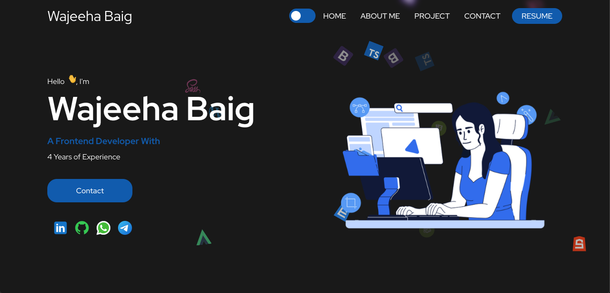

# Wajeeha Baig — Portfolio 2024



## About

This repository contains my **2024 personal portfolio website**, created during an earlier stage of my development journey.

The portfolio was built to introduce myself as a developer and showcase my skills, projects, and contact information.

It represents my work and design approach at that point in my career and is part of the progression that led to my later frontend and full-stack projects.

## ✨ What's Inside

* Personal introduction
* Skills and technologies
* Featured projects
* Developer experience
* Contact information
* Responsive portfolio interface

## 🛠️ Built With

* **React**
* **TypeScript**
* **Styled Components**
* **Create React App**

## 🚀 Getting Started

Clone the repository and install the dependencies:

```bash
yarn install
```

Start the development server:

```bash
yarn start
```

The portfolio will then be available locally through the development server.

## 📸 Preview

The screenshot above shows the home screen of the 2024 portfolio.

## 📌 About This Version

This is an **archived version of my portfolio from 2024**. My skills, projects, and development experience have continued to grow since this version was created.

Keeping this repository allows me to document my progression as a developer and preserve an earlier milestone in my journey.

---

### Author

**Wajeeha Baig**

Frontend / Full-Stack Developer

[GitHub](https://github.com/wajeehabaig9)
